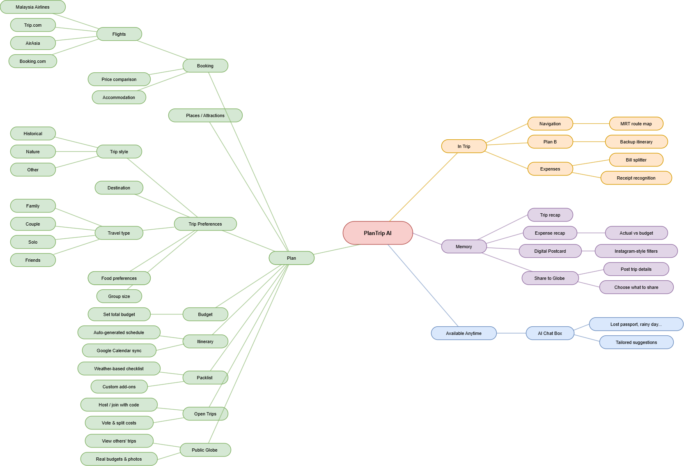
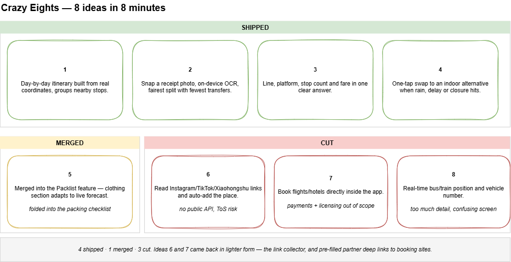
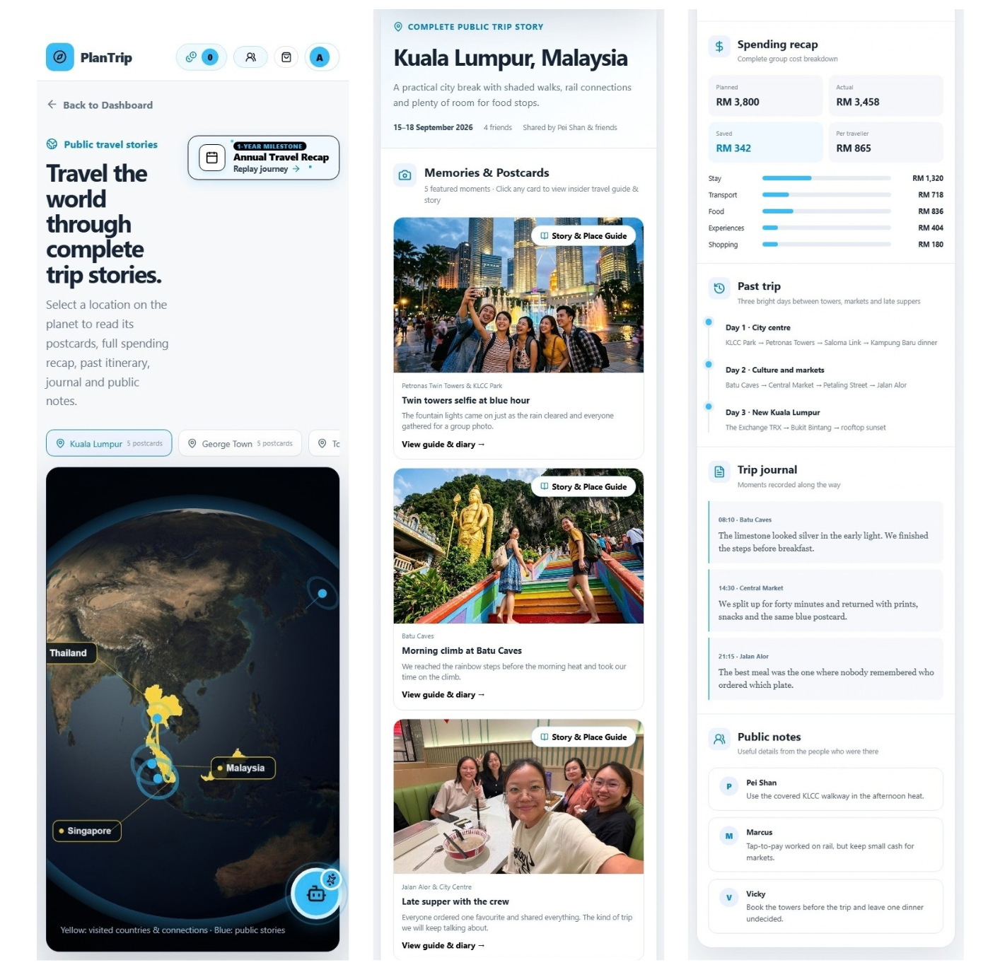
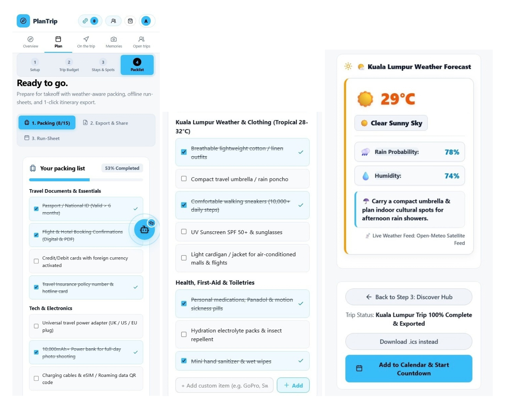
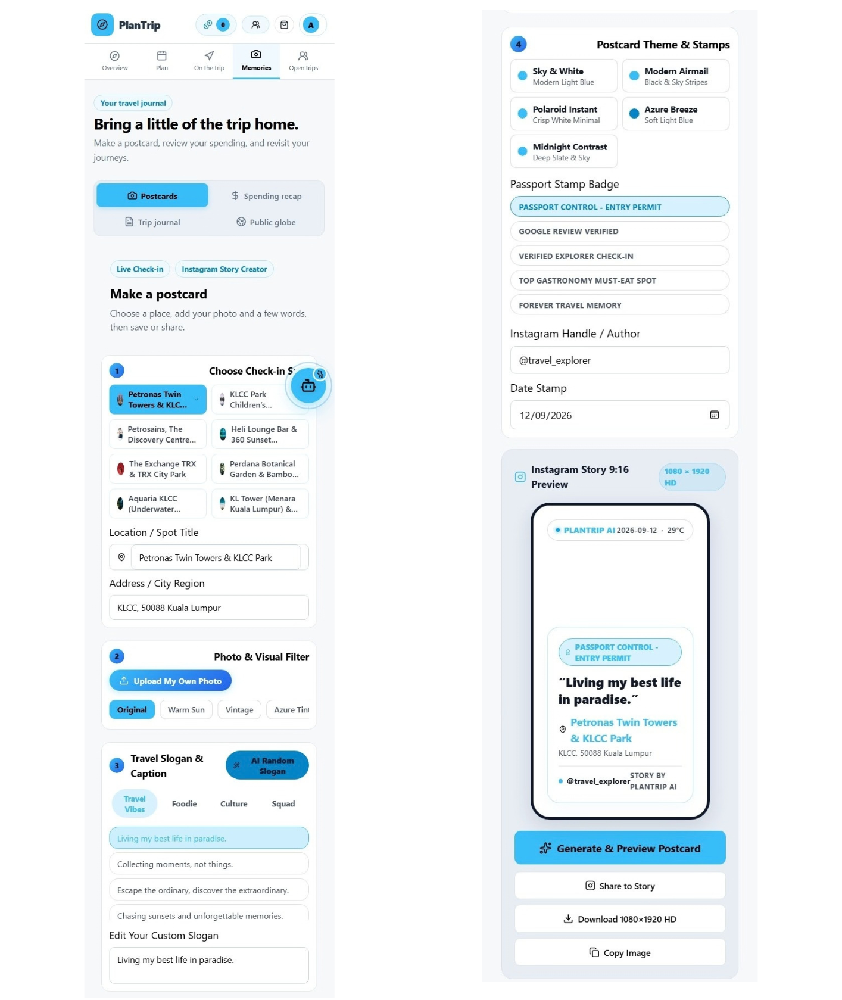
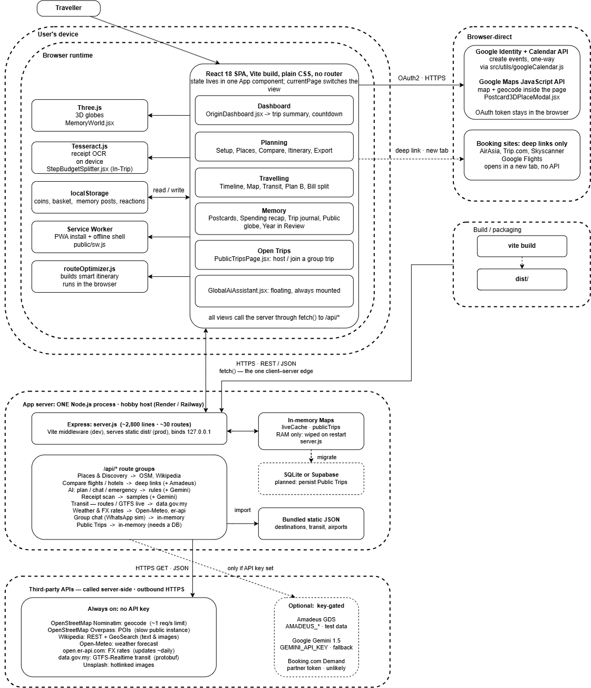

# **PlanTrip by WeCodeFirmWin** 

**Team:** Mow Zi Yi, Mui Rui Xin, Lim Pei Shan, Vicky Pong Wai Kay

**Problem Statement:** Travel Planner

**Video Presentation:** [https://youtu.be/znA6Q0-Md1Q](https://youtu.be/znA6Q0-Md1Q)\]&nbsp;

**Presentation Slides:** \[[https://canva.link/2keo58u50n4oo0p](https://canva.link/2keo58u50n4oo0p)\]&nbsp;

---

[**PlanTrip by WeCodeFirmWin	1**](#plantrip-by-wecodefirmwin)

[**1\. Project Overview	1**](#1.-project-overview)

[**2\. Ideation & Process	5**](#2.-ideation-&-process)

[**2.1 Ideas We Considered	5**](#2.1-ideas-we-considered)

[**2.2 Ideation Boards	7**](#2.2-ideation-boards)

[**2.3 Mentor Consultation	9**](#2.3-mentor-consultation)

[**3\. Design & Prototype	10**](#3.-design-&-prototype)

[**4\. What Makes It Different	14**](#4.-what-makes-it-different)

[**5\. Technical Architecture & Feasibility	16**](#5.-technical-architecture-&-feasibility)

[**6\. How to Run Plan Trip on Your Computer (3 Easy Steps)	21**](#6.-how-to-run-plan-trip-on-your-computer-\(3-easy-steps\))

&nbsp;

---

## **1\. Project Overview** 

Trip planning is fragmented across tools that don't share state. A traveller shortlists places in Google Maps, compares fares on three booking sites, drafts a schedule in a spreadsheet, coordinates in WhatsApp, navigates with a separate transit app, and settles money with a calculator. Nothing carries forward, so the same trip gets re-entered five times, and the moment reality diverges from the plan, the whole thing has to be rebuilt by hand.&nbsp;

&nbsp;

**Four causes sit underneath this:**

1. No shared trip object. Each tool owns its own fragment of the trip and none of them exposes it in a form the next tool can consume. The traveller is the integration layer, re-typing the same dates, party size and place list into every app.  
2. Itineraries are static documents. A plan in Docs or Notion has no model of where things are or how long they take, so it can't reorder itself. When it rains, a venue closes, or a flight slips, the plan is simply wrong and there's no mechanism to repair it, only manual re-planning under time pressure.  
3. Local operational knowledge is not in the plan. Which rail line, which direction, how many stops, what the fare is, which items on a receipt were yours, this is exactly the information a visitor needs at the moment of decision, and it lives nowhere near their itinerary.  
4. Group coordination has no owner. One organiser absorbs the scheduling, the dietary constraints, the money and the chasing. Existing tools serve the individual traveller; the coordination burden is what actually makes group trips painful.  
   &nbsp;

**Stakeholders**

Primary users are leisure travellers in the three shapes the app is explicitly built around: the group organiser (the expense splitter defaults to a multi-member squad and computes minimum settlement transfers), the independent urban traveller (the transit wayfinder), and families/couples (party-aware and dietary-aware ranking in AttractionsGrid / RestaurantsGrid).&nbsp;

&nbsp;

**Why existing apps fall short.**&nbsp;

Wanderlog is the closest competitor and the strongest collaborative itinerary builder on the market, shared editing, map view, saved places, and some route grouping. But it treats the itinerary as a document to co-author, not a state machine to repair: there is no one-tap disruption recovery that rewrites an affected day, no itemised receipt splitting from a photo, and no station-level transit answer with a fare attached. Its assistant is a prompt box that generates plans, not something that patches a single slot of an existing plan and leaves the rest untouched.&nbsp;

TripIt is narrower, it parses confirmation emails into a timeline, which only helps after every decision is already made elsewhere.&nbsp;

Splitwise solves money alone and paywalls receipt scanning.&nbsp;

TripAdvisor optimises discovery and reviews, then hands you off.&nbsp;

The consistent pattern: each incumbent owns one stage and abandons the traveller at the seams, which is precisely where the time and stress are. None of them look backward either. Once a trip ends, its data is archived and forgotten, instead of being turned into something the traveller actually wants to revisit.

&nbsp;

**Our Solution**

PlanTrip is a travel companion that covers the whole trip. It's a React and Vite web app with an Express API behind it, packaged for Android with Capacitor. Every screen shares one live trip object (destination, dates, travel party, budget, basket, itinerary, members), so nothing gets typed in twice between stages. The app follows the trip in three stages: Plan (discover, compare, schedule, pack, export), On the trip (split receipts, find transit, recover when plans break) and Memories (postcards, spending recap, public stories, an annual travel recap). What makes it different is that the itinerary is calculated, not written: a route optimiser builds each day from real coordinates, and a scenario engine rewrites the affected day in one tap when something goes wrong.&nbsp;

&nbsp;

**Feature lists:**

**BEFORE THE TRIP (Plan tab)**

1. Trip Setup  
* Enter who's travelling, the trip pace, the vibe you want and any dietary needs. The app uses these answers to personalise its recommendations.  
2. Trip Budget  
* Set a total budget and a spending tier (Budget, Balanced, Premium, Luxury).  
3. Flight & Hotel Price Comparison  
* Compare flights and stays across AirAsia, Trip.com, Booking.com, Skyscanner and Agoda, then open the booking page with your dates and guests already filled in.  
4. Personalised Places & Restaurants  
* Attractions and restaurants are ranked for your travel group (family, couple, solo, friends) and dietary needs (Halal, vegetarian, vegan, gluten free, no pork, no seafood), with badges and an interactive map.  
5. Smart Route Builder  
* Enter your dates, confirm your saved places and choose a starting point. It builds a day-by-day itinerary that groups nearby stops and shows the drive time and distance between them.  
6. Trip Basket  
* Save places from anywhere in the app and track the running total against your budget.  
7. Packlist & Export  
* A packing checklist, plus export of the full plan as a Word document, a PDF or a Google Calendar (.ics) file.  
8. Open Trips  
* Host a trip or join someone else's. Members propose attractions and restaurants and vote on them, and a stop is added once at least half the group votes for it. Shared costs are logged with an automatic "who owes whom", and the host locks the plan once the minimum number of people has joined.

&nbsp;

**DURING THE TRIP (On the trip tab)**

1. Split Expenses & Receipt Scanning  
* Snap a receipt photo and the items are read automatically (AI scanning with an on-device OCR fallback). Assign items to people, switch between 12 currencies at live exchange rates, see who owes whom, and share the summary to WhatsApp.  
2. Local Transport (Malaysia)  
* Choose where you're starting and where you're going to get the right LRT, MRT, Monorail, KTM, BRT or bus route, with the Touch 'n Go fare.  
3. Backup Plans (Plan B Studio)  
* If it rains, a flight is delayed or an attraction is closed, swap in an indoor alternative with one tap.

&nbsp;

**AFTER THE TRIP (Memories tab)**

1. Postcards  
* Turn trip photos into postcards with 5 themes, photo filters, stamp badges and slogans, then share them to Instagram.  
2. Spending Recap  
* Compare your planned budget with what you actually spent, category by category, plus the group's final settlement.  
3. Trip Journal  
* A full trip write-up covering the budget breakdown, logistics, the day-by-day schedule and packing tips. Download it as a Word document or print it to PDF.  
4. Public Globe & Travel Story Spotlight  
* Publish your trip to a 3D community globe and choose what to share. Open other travellers' stories full-screen with ambient soundscapes, and add any spot to your own trip plan.  
5. Travel Year Recap  
* A year-in-review showing your top 5 destinations, where the budget went, your travel squad, your postcards and your travel persona. You can switch between years and share it.

&nbsp;

**AVAILABLE ANYTIME**

- AI Travel Companion: a floating assistant on every screen that suggests food, gives directions and local tips, and can update your itinerary directly.  
- Account: log in and sign up.

&nbsp;

---

## **2\. Ideation & Process** 

### **2.1 Ideas We Considered** 

|  | Idea | Why it was kept |
| :---- | :---- | :---- |
| A | A globe on the dashboard that shows other people's public trips. | It makes the home screen feel alive, and a new user can learn from real trips, their budget and their photos, before planning their own. |
| B | Open Trips. Host or join a public group trip with a code. | Planning group trips is hard, especially with new people. This feature lets strangers team up, share costs fairly, and travel together.&nbsp; |
| C | Price compared by a pre-filled link, not a booking bot.&nbsp; | This feature gives users a rough estimate of flight and accommodation costs through a pre-filled link. It is safe, free, and rule-compliant, since users still book directly on the official site.&nbsp; |
| D | Weather-aware packing list.&nbsp; | The app pulls the live forecast for your destination and turns it into advice. For example, if it is hot, it will advise you to bring along sunscreen and sunglasses. The clothing checklist matches the city's climate instead of being one fixed list. |
| E | Receipt photo scan and fair split, done on the phone. | Instead of manually counting who owes what, the app scans the receipt photo on-device, lets each user select which items they got, and automatically calculates a summary showing the fairest split with the fewest transfers needed. |
| F | A simple local transit guide with the line, platform and fare. | A visitor needs one clear answer, not raw data. So we show the line, the platform gate, the stops, and the price. |
| G | Plan B for bad days. | A normal plan breaks when it rains or a place closes. This lets the plan fix itself, swapping outdoor stops for nearby indoor ones with one tap to handle emergencies or sudden changes like rain or flight delays. |
| H | Memory Postcard | Users turn their trip moments into a personalized postcard by picking a location, photo, filter, slogan, theme, and stamps, then share it straight to Instagram. |
| I | Share to Globe | Users bring their trip memories together and choose what to share, whether it's the itinerary, budget, or photos, so it appears on a public globe for other travelers to use as reference.&nbsp; |
| J | AI Chat Box | Users can ask questions about any situation, like a lost passport or a rainy day, and the AI gives recommendations, advice, or suggestions tailored to that situation. |
| K | Year in Review, a yearly summary of a user's trips. | Our mentor pointed out that all the trip data we already save (postcards, budgets, places visited) just sits there and is never looked at again. A yearly recap turns old data into something the user actually wants to open, and it gives people a reason to come back to the app even when they are not planning a new trip.&nbsp; |

&nbsp;

|  | Idea | Why it was dropped |
| :---- | :---- | :---- |
| A | An assistant that reads Instagram, TikTok or Xiaohongshu links and adds the place to the trip. | We could not do this well in the time we had. Each platform needs its own API or scraping, then a step to look up the real place.&nbsp; |
| B | A live screen of every bus and train with its GPS position and vehicle number. | A live screen showing every bus and train's GPS position and vehicle number had too much detail. Travelers don't care about vehicle numbers, and it just made the screen look complicated and confusing. |
| C | Turning phone photos into 3D models.&nbsp; | Turning phone photos into 3D models sounded fun, but it stretched people's faces and didn't actually help anyone plan a trip.&nbsp; |

&nbsp;

### **2.2 Ideation Boards** 

**Mindmap**

Our opening session: every traveller frustration we could name, dumped out and then grouped by when it happens. The before / during / after clustering wasn't planned; it emerged here, and became the app's three top-level stages.&nbsp;

&nbsp;

**Crazy Eights Board**

Eight ideas sketched in eight minutes: four shipped as-is, one folded into the packing checklist, and three cut for scope, privacy, or licensing reasons. The two hardest cuts — social link importing and in-app booking — came back later in lighter form as the link collector and pre-filled partner deep links.&nbsp;

&nbsp;

### **2.3 Mentor Consultation** 

| Date | Mentor | Feedback Received | What Was Changed |
| :---- | :---- | :---- | :---- |
| 4/9/2026 | Jarod Tan | • The first version had cold gray boxes and stark contrast. It looked like a technical server monitor rather than an exciting travel app.    • To understand the whole architecture of the product | • We redesigned the interface with warm, natural sand tones (\#fbf9f5), friendly typography, rounded cards, gentle glows, and plenty of breathing room. It now feels welcoming and inspiring.   • Created system architecture diagram to know the whole flows of it |
| 8/9/2026 | Teh Ming En | • Avoid too many color Know why ur app so special   • Keep highlighting interesting features | • Changed colours to all blue palette   • Find the masters/special features from our app |
| 10/9/2026 | Iris Yan | • The features like globe, checklist and memory postcard are interesting   • Add a Summary of the year analytics for Memory postcard | • Create a thing like Spotify Wrap to show the top 5 destinations/budgets/trips of the year |

&nbsp;

---

## **3\. Design & Prototype** 

**UI Prototype:** \[[https://frontend-deploy-lyart.vercel.app/](https://frontend-deploy-lyart.vercel.app/) \]

**User to test in Website:**  
username: traveller

password: password123

**Globe 3D \- Public Memories**

This globe showcases postcards that users published, the numbers in the stars meaning how many posts are posted for this destination.&nbsp;

**Plan \- Packlist**

This checklist is based on the planned destination’s weather, in the 3rd category.

Users can choose to tick off the checklist when they’re packing to make it easier and save times to list out. They can also add custom items to the list based on their own preference.&nbsp;

**Memories \- E-postcard**

For memory e-postcard, this is for the user to customize their postcard to record the moments of the trip.&nbsp;

---

## **4\. What Makes It Different** 

&nbsp;

PlanTrip is not about putting every travel tool into one app. You can find most of our features in other apps too. What makes us different is how the features work together across the whole trip. The app has three parts: before, during and after.

&nbsp;

**Before Trip (Dashboard and Planning):**

On the dashboard, the main thing is a 3D globe. You can spin it and search any city. From there you open the Public Globe, where you can see trips shared by other travellers, with their real budgets and their photos, before you plan your own. In the Planning part there is a packing checklist. It is simple and friendly. It just helps you check that you packed everything, so you can leave home without stress.&nbsp;

&nbsp;

**During Trip (Travelling):**  
Splitting the bill is usually the annoying part of a group trip. In our app it is easy. You take a photo of the receipt, each person taps what they ordered, and the app works out who owes who. It uses the smallest number of transfers, so nobody has to pay each other many times. You can also send the result to WhatsApp.

&nbsp;

**After Trip (Memory):**

After the trip, it does not just become a folder of receipts. The app turns it into a memory postcard. You can also add your trip to a shared community globe, so other people can see it. From the public globe, you can also open your own Year in Review, a short recap of your travel year, like a Spotify Wrap, with your top destinations, days away and money spent.

&nbsp;

The new part is how these three stages connect. Each stage also has small, human touches. And a few technical choices only work because the whole trip is joined up.

&nbsp;

**Novel features**

&nbsp;

One app, one trip. The basket you build when planning becomes your live plan during the trip, then your spending summary and your memory globe after. You never type the same thing twice. Other apps each do one part only. Wanderlog plans, TripIt stores tickets, Splitwise splits money, a photo app keeps photos. We keep it all as one trip.

&nbsp;

**Twist**
| 1\. | Year in Review across multiple trips. At the end of the year, the app looks back at all of a traveller's trips and builds a short recap such as top destinations, total days away, total spend,  like a Spotify Wrap, but for travel. None of the apps in the comparison table do this across multiple trips.&nbsp; |
| :---- | :---- |
| 2\.&nbsp; | Recommendations that match your group. Choose Family, Couple, Solo or Friends, and diet rules (halal, vegetarian, vegan, no seafood, no pork, gluten free). The list of places and restaurants re-sorts and re-labels right away, instead of one fixed list for everyone. |
| 3\. | Plan B Studio. When it rains, a flight is late, or a place is closed, one tap swaps the outdoor stops for good indoor places within about 1 km and rebuilds the day. Most plan apps are just a fixed document. Here the plan is made to change.&nbsp; |

&nbsp;

**Fairly original**&nbsp;

| 1\. | Open Trips. Anyone can host a public group trip. Others join with a code, suggest places, vote, and split shared costs. Any public trip can be copied into your own private planner with one click. |
| :---- | :---- |
| 2\. | Memory postcard. Turns a check-in photo into a shareable postcard instead of a camera roll photo. Pick a caption from preset slogans (food, culture, vibes, squad) or write your own, and the app lays it out as a postcard you can download or share straight to Instagram. Most trip apps just store your photos, here every stop becomes something you'd actually want to keep and share. |
| 3\.&nbsp; | Public Globe. A 3D globe of trips shared by real travellers. Spin it, pick a city, and open a past trip to see its real budget, itinerary and postcards before you plan your own. Most travel apps show you reviews or stock photos, here you're looking at what an actual trip cost and looked like. |
| 4\.&nbsp; | Smart packlist. A packing checklist that rebuilds itself around where you're actually going. It pulls the destination's live weather and swaps the clothing section to match, jacket and layers for a colder city, rain gear for a rainy one, instead of one fixed list for every trip. Tick items off as you pack, and it's saved for you to check again the night before you leave. |

&nbsp;

&nbsp;

| Capability | Wanderlog | TripIt | Splitwise | TripAdvisor | PlanTrip |
| :---- | :---- | :---- | :---- | :---- | :---- |
| Whole trip as one set of data | Partial | None | None | None | Yes |
| Year in Review across multiple trips&nbsp; | None | None | None | None | Yes |
| Live contingency re-routing (rain, delay, closure)&nbsp; | None | None | None | None | Yes |
| Community trips and one-click copy | Partial | None | None | Partial (reviews) | Yes |

&nbsp;

---

## **5\. Technical Architecture & Feasibility** 

**Tech stack**

| Layer | Choice | Why we chose it | Constraints we expect |
| :---- | :---- | :---- | :---- |
| Frontend | React 18 with Vite, plain CSS, no router | The app is one screen with different views, so one main component with a currentPage value is enough. It keeps the build small, and Vite reloads fast. | The main component is getting big and we pass many props down. We will need to split it later. Plain CSS means there is no shared design system. |
| On-device engines | Three.js, Tesseract.js (WASM), Web Audio API | They run in the browser, so they are free, private, and work offline. | Three.js is about 150 KB and is heavy on cheap phones. Tesseract downloads a 2 to 4 MB model the first time and takes 2 to 4 seconds per receipt. We help this with sample receipts and a manual fix step. |
| Backend | Node.js with Express, one process (about 29 routes) | Same language as the frontend. One service serves the API and the built files. We do not need microservices at this size. | It cannot scale to many servers. Data kept in memory is lost on restart. The free host is slow to wake up. |
| Database | None yet. SQLite (a file) during the build phase. Supabase (hosted Postgres with login) only if group features grow. | SQLite needs no setup and is enough for one server. Supabase is free and also gives us login and realtime. | Supabase's free tier pauses after about a week idle and caps rows and bandwidth. SQLite needs a mounted volume or it is wiped on ephemeral hosts, so we start with SQLite on a Render disk and migrate only if needed. |
| APIs (no key) | OpenStreetMap Nominatim (find places), OpenStreetMap Overpass (list places), Wikipedia, Open-Meteo (weather), open.er-api.com (money rates), data.gov.my (transport) | Free, open, no sign-up, and good coverage for Malaysia. | Nominatim allows about 1 request per second, so we cache results and send a proper User-Agent. Public Overpass is slow, so we cache and slow down calls. The transport feed sometimes goes down, so we keep a fixed backup schedule. Open-Meteo is for non-commercial use. |
| APIs (keygated, optional) | Google Gemini 1.5 Flash (AI enhance), Amadeus Self-Service (flights and hotels), Google Calendar with Identity (event export) | Each has a free tier, and each has a backup if we have no key. So the app never fully depends on them. | Gemini's free tier has limits and no uptime promise, so the rule engine is the default. Amadeus's free tier gives test data only; real data needs a partner deal, so we use links instead. Google login stays in "test" mode (max 100 users, added by hand) until Google reviews it, and the token stays in the browser, so users log in again each session. |
| Documents and export | Word (.doc built from HTML) and print to PDF in the browser. Calendar uses the API above. | No server, no paid library, works offline. | The .doc style is basic. PDF quality depends on the browser. |
| Images | Unsplash (linked directly) | Free, fast, good enough for a prototype. | Direct linking is not safe for production and the old link method is removed. We will use the real Unsplash API key or ship our own photos. |
| Booking | Deep links only (AirAsia, Trip.com, Skyscanner, Booking.com, Google Flights) | No card details, no scraping, no rule breaking, no cost. The real site does the booking. | We can show rough prices, not real live prices, without a paid system. |
| Hosting | One Render or Railway web service. One Node process serves the API and the static files. | One service, one deploy, one link. The free tier is enough for a demo. | The free tier sleeps after about 15 minutes (30 to 60 seconds to wake), has limited hours, and wipes its disk. So we add a small "keep awake" ping and a saved disk for SQLite. |

&nbsp;

**System architecture diagram**&nbsp;

&nbsp;

**Build plan & scope**

Already working now:

&nbsp;

* All stages (Before Trip \- Planning, During Trip \- Travelling, After Trip \- Memory) are working and connected  
* Real places and restaurants pulled from OpenStreetMap and Wikipedia  
* Live weather and currency rates  
* Malaysia transport routes with line, platform, stop count and fare (hand-modelled data)  
* Live GTFS vehicle positions from data.gov.my, shown separately  
* Receipt scan on the phone with fair split among the group  
* Rule-based AI for planning, chat and emergency help, with Gemini as an optional upgrade when a key is set  
* Google Calendar export (tested and working)  
* Flight and hotel price comparison through pre-filled links  
* 3D memory globe to explore other travellers' trips  
* Year in Review recap, showing each traveller's top destinations and spending for the year, currently showing demo data  
* All data saved on the user's own device in the browser

&nbsp;

**We will build these in the build phase.**

1. **Open Trips with real accounts.** Right now, public trips only live in the server's memory, so they disappear when the server restarts. In the build phase we will connect it to a real database with proper API calls, so a hosted trip and its join code stay live for other users to find and join anytime.  
2. **Public transport for other countries.** Right now the transit wayfinder only understands Malaysia. We plan to build a backend that reads each destination's own transport data, stores it in a database, and works out routes the same way we do for Malaysia, so travellers in other cities get the same line-and-fare answer.  
3. **A chatbox that actually talks with AI.** What we have now mostly matches keywords and returns a fixed answer. In the build phase, we want the assistant to hold a real conversation, understand follow-up questions, and reason about the user's actual plan instead of just reacting to a trigger word.

**Not in this phase:**

* Real payment or booking inside the app (we send users to the official site)  
* A native app listed on the App Store or Play Store as the product stays web-only&nbsp;  
* Trips across many cities or countries in one itinerary  
* Real-time shared editing for Open Trips (it checks for updates on a timer, not live)  
* The Google Maps 3D place view (needs a paid Maps key)  
* Any login system beyond Google

---

## **6\. How to Run Plan Trip on Your Computer (3 Easy Steps)**

**What You Need First**

Node.js: Version 18 or newer (download free from nodejs.org)

Any modern web browser (Google Chrome, Microsoft Edge, Safari, or Firefox)

&nbsp;

**Step 1: Download & Install**

Open your terminal or command prompt, navigate to the folder, and run:

&nbsp;

git clone https://github.com/sharonxinn/Plan\_Trip.git

cd Plan\_Trip

&nbsp;

**npm install**

&nbsp;

**Step 2: Start the App**

Start the local server by typing:

&nbsp;

**npm run dev**

&nbsp;

Now open your web browser and go to: 👉 **http://localhost:5173**

&nbsp;

Created with ❤️ for travelers everywhere. Enjoy your journey with Plan Trip\!