# 🌍 Roamly — Your All-in-One Smart Travel Companion
> **Everything you need for an easy, stress-free trip — before you leave, while you're there, and after you come home.**

[](LICENSE)
[](https://react.dev/)
[](https://nodejs.org/)
[](https://threejs.org/)
[](https://ai.google.dev/)
[](https://data.gov.my/)
[](https://capacitorjs.com/)

---

## 📌 What is Roamly? Quick Links & Overview

- 🎥 **Watch the Demo**: [Click here to watch our 5-minute video walkthrough](https://youtube.com)
- 🌐 **Try It Live**: Open the web app on your computer at [http://localhost:5173](http://localhost:5173)
- 📱 **Mobile App**: Ready to install on Android phones (files located in the `/android` folder).
- 💡 **In a Nutshell**: Have you ever planned a vacation and ended up with 30 open browser tabs, messy spreadsheets, and confusing group chats? Roamly fixes that. It brings everything together into one friendly app: compare flight and hotel prices, build a smooth day-by-day itinerary, navigate local trains and buses with exact ticket fares, swap to indoor activities in one tap when it rains, split restaurant bills by snapping a photo of the receipt, and relive your journey through beautiful travel stories with relaxing soundscapes.

### 🌟 Everything You Need in 3 Simple Steps

Roamly organizes your holiday into three natural stages:


#### 🛫 1. Before Your Trip: Easy Planning & Preparation
1. **Interactive 3D Spinning Globe**: Spin a beautiful 3D digital Earth, type any city name, and watch the camera glide smoothly to your destination.
2. **Dynamic Recommendations Tailored to You**: Tell Roamly who is coming and what you love to eat, and watch your recommendations transform immediately!
   - Traveling as a **Family with Kids**? Roamly instantly ranks giant playgrounds (like the 2-acre climbing playground and water splash pool at KLCC Park), interactive science discovery centers, and restaurants with highchairs and kid menus at the top.
   - Traveling as a **Romantic Couple**? It surfaces scenic sunset rooftops, sky decks, and cozy candlelit bistros.
   - Have dietary preferences like **Halal, Vegetarian, Vegan, No Seafood, No Pork, or Gluten Free**? Roamly highlights 100% verified safe spots with bright green badges and flags dishes with ingredients you want to avoid.
3. **Live Flight & Hotel Price Checker**: Compare live flight and hotel prices side by side across trusted travel websites (**AirAsia, Booking.com, Trip.com, and Skyscanner**). When you find the best deal, click once to go straight to their booking page with your dates and guest numbers already filled in!
4. **Trip Basket & Spending Tracker**: Save places you love into your personal trip basket. Watch your total estimated cost update in real time so you stay comfortably within your budget.
5. **Smart Day-by-Day Schedule Planner**: Our smart assistant arranges your daily stops so nearby places are visited together. You will never have to waste hours zig-zagging back and forth across town!
6. **Group & Luggage Organizer**: Keep track of everyone joining the trip, their dietary restrictions, luggage allowances, and countdowns to make sure no one’s passport expires before departure.
7. **Print or Export in 1 Click**: Download your complete travel plan as a ready-to-print **Microsoft Word document (.doc)**, an offline **PDF**, or sync all your daily activities straight into your **Google Calendar**.
8. **Conversational AI Travel Companion**: A friendly animated floating buddy that talks naturally. Ask for dinner ideas, train directions (like KTM Komuter platform numbers and Touch 'n Go fares), or tell it to update a specific meal in your schedule without altering any other days!

#### 🚆 2. During Your Trip: Smooth Navigation & Backup Plans
1. **Live Daily Schedule**: As you travel, see your current stop, what comes next, walking times, and helpful countdown clocks to keep your group on track.
2. **Interactive Walking Map**: An easy-to-follow map that highlights your walking routes and shows your live GPS location so you never feel lost.
3. **Easy Train & Bus Guide (Malaysia)**: Traveling around Kuala Lumpur? Simply pick your starting point and destination. Roamly tells you exactly which train (LRT, MRT, Monorail) or bus to catch, which platform gate to walk to, and the exact ticket fare (e.g. `RM 2.40` with Touch 'n Go).
4. **Instant Rainy Day & Delay Backup (Plan B Studio)**: Sudden tropical rainstorm? Flight delayed? Attraction unexpectedly closed? Tap one button to instantly swap outdoor spots for top-rated indoor alternatives nearby (like museums or aquariums within 1 km) without stressing out.
5. **Group Chat & Dinner Polls**: Chat with your travel buddies right inside the app and run quick polls to easily agree on where to eat dinner.
6. **Save Spots from Instagram & TikTok**: Saw an amazing café on Instagram Reels, TikTok, or Xiaohongshu? Paste the link, and Roamly automatically finds the place name and drops it onto your itinerary map.
7. **Snap Receipts & Split Bills Fairly**: Take a quick photo of your paper restaurant receipt. Roamly automatically reads each item and tax amount, lets friends check off what they ordered, and calculates the easiest way to settle up with the fewest money transfers. Send a friendly summary straight to your group's WhatsApp in one tap!
8. **Live On-the-Road AI Guidance**: Stranded in the rain or wondering what to eat nearby? Open the floating AI assistant for instant transit directions, rainy day alternatives, and local Malaysian language tips.

#### 📸 3. After Your Trip: Reliving Memories & Community
1. **Digital Passport Stamps & Diary**: Collect fun commemorative digital stamps as you complete each day of your journey, and write down your personal thoughts and highlights.
2. **Memory World 3D Community**: Explore a community globe where real travelers share their favorite vacation memories, photo highlights, and honest recommendations.
3. **Travel Story Spotlight & Interactive Place Guide**: Click on any travel memory card to open a full-screen story spotlight. Enjoy high-resolution photography, listen to relaxing background sounds (like a gentle city breeze, quiet temple chimes, or cozy café chatter), read tips on the best photo angles and subway exits, and tap **"+ Add Spot to My Trip Plan"** to save it straight to your next holiday!
4. **Copy Community Trips with 1 Click**: Found an itinerary from another traveler that you love? Click one button to copy their entire trip into your own planner, where you can tweak it to match your own style.

---

## 📑 Table of Contents
1. [💡 Section 1: How Roamly Was Born (Ideation)](#-section-1-how-roamly-was-born-ideation)
   - [1.1 Mindmaps & What Travelers Struggle With](#11-mindmaps--what-travelers-struggle-with)
   - [1.2 How Our Idea Evolved Through 5 Versions](#12-how-our-idea-evolved-through-5-versions)
   - [1.3 Advice from Our Mentor and Improvements Made](#13-advice-from-our-mentor-and-improvements-made)
   - [1.4 Comparing Different Approaches](#14-comparing-different-approaches)
2. [✨ Section 2: What Makes Roamly Unique & Creative](#-section-2-what-makes-roamly-unique--creative)
   - [2.1 The Complete Journey in One App](#21-the-complete-journey-in-one-app)
   - [2.2 Six Standout Features You Won't Find Elsewhere](#22-six-standout-features-you-wont-find-elsewhere)
   - [2.3 How Roamly Compares to Other Travel Apps](#23-how-roamly-compares-to-other-travel-apps)
3. [⚙️ Section 3: How It Works & Why It Is Reliable](#-section-3-how-it-works--why-it-is-reliable)
   - [3.1 Technologies Used (Simple Overview)](#31-technologies-used-simple-overview)
   - [3.2 How Data Moves Through the App](#32-how-data-moves-through-the-app)
   - [3.3 Development Timeline & Milestones](#33-development-timeline--milestones)
   - [3.4 Keeping Operating Costs Near Zero ($0 API Costs)](#34-keeping-operating-costs-near-zero-0-api-costs)
4. [📱 Section 4: Full Feature Guide for Every Stage of Travel](#-section-4-full-feature-guide-for-every-stage-of-travel)
   - [Stage 1: Before the Trip (Planning)](#stage-1-before-the-trip-planning)
   - [Stage 2: During the Trip (On the Ground)](#stage-2-during-the-trip-on-the-ground)
   - [Stage 3: After the Trip (Memories & Community)](#stage-3-after-the-trip-memories--community)
5. [🔌 Section 5: How Each Key Feature Was Built](#-section-5-how-each-key-feature-was-built)
   - [5.1 Live Hotel & Flight Price Comparison](#51-live-hotel--flight-price-comparison)
   - [5.2 Google Star Ratings, Smart Scheduling & Calendar Sync](#52-google-star-ratings-smart-scheduling--calendar-sync)
   - [5.3 Public Transit & Exact Ticket Fares (Malaysia)](#53-public-transit--exact-ticket-fares-malaysia)
   - [5.4 Photo Receipt Scanning & Easy Bill Splitting](#54-photo-receipt-scanning--easy-bill-splitting)
   - [5.5 Relaxing Soundscapes & 1-Click Trip Saving](#55-relaxing-soundscapes--1-click-trip-saving)
   - [5.6 Dynamic Recommendations & Dietary Engine](#56-dynamic-recommendations--dietary-engine)
   - [5.7 Conversational AI Travel Engine](#57-conversational-ai-travel-engine)
6. [🎨 Section 6: Beautiful & User-Friendly Design](#-section-6-beautiful--user-friendly-design)
   - [6.1 Warm, Natural Color Palette](#61-warm-natural-color-palette)
   - [6.2 Smooth Controls & Big Easy-to-Tap Buttons](#62-smooth-controls--big-easy-to-tap-buttons)
   - [6.3 Complete, Ready-to-Use Screens](#63-complete-ready-to-use-screens)
7. [🌍 Section 7: Real-World Impact & Target Users](#-section-7-real-world-impact--target-users)
   - [7.1 The Real Problems Travelers Face Every Day](#71-the-real-problems-travelers-face-every-day)
   - [7.2 Who Roamly Is Built For (User Stories)](#72-who-roamly-is-built-for-user-stories)
   - [7.3 Time & Money Saved: Before vs. After](#73-time--money-saved-before-vs-after)
   - [7.4 How Roamly Can Grow as a Business](#74-how-roamly-can-grow-as-a-business)
8. [🎬 Section 8: 5-Minute Video Pitch Script](#-section-8-5-minute-video-pitch-script)
9. [🚀 Section 9: How to Run Roamly on Your Computer (3 Easy Steps)](#-section-9-how-to-run-roamly-on-your-computer-3-easy-steps)

---

# 💡 Section 1: How Roamly Was Born (Ideation)

> [!NOTE]
> **Our Design Journey**: This section shares our story from initial brainstorming to final testing: the problems we discovered, ideas we tested and tossed away, and how feedback made the app so much simpler and more enjoyable.

---

### 1.1 Mindmaps & What Travelers Struggle With

#### A. Everything Roamly Does in One Simple Picture
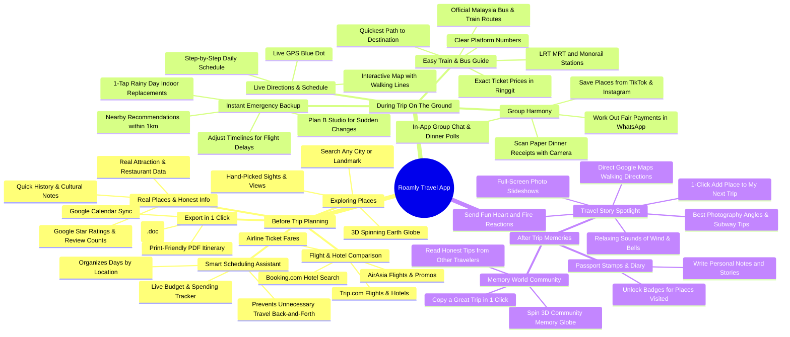

#### B. The Travel Problem Tree: Why Modern Travel Feels Broken
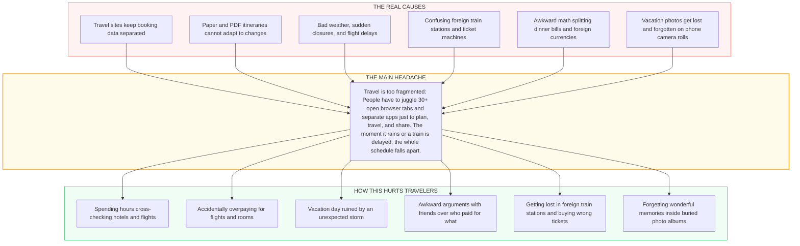

#### C. How a Traveler Uses Roamly from Start to Finish
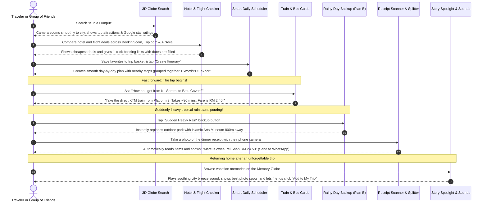

---

### 1.2 How Our Idea Evolved Through 5 Versions

Great ideas don't appear out of nowhere. We tested 5 different versions of our concept, learned what didn't work in real life, and improved it step by step:

```mermaid
timeline
    title How Roamly Evolved in 5 Steps
    section Version 1: Chatbot Only
      Our First Idea : A simple AI text chatbot to plan your entire trip
      The Problem : It made up fake bus lines and recommended closed venues
      What We Did : Scrapped it! Replaced with real, verified map and review data
    section Version 2: Auto-Booking Robot
      Our Next Idea : A bot that automatically books flights and hotels for you
      The Problem : Users felt unsafe sharing credit cards; websites blocked bots
      What We Did : Scrapped it! Replaced with safe 1-click links to official websites
    section Version 3: 3D Distorted Photo Gimmick
      Our Third Idea : Turning 2D camera photos into 3D polygon meshes
      The Problem : Distorted people's faces and didn't help with trip planning
      What We Did : Replaced with Travel Story Spotlight: beautiful photos, relaxing sounds, transit tips & 1-click trip saving
    section Version 4: Raw Train Data Screen
      Our Fourth Idea : Showing live technical GPS coordinates of every city bus
      The Problem : Overwhelmed travelers with confusing bus ID numbers
      What We Did : Simplified into a friendly train and bus guide with station names, platforms, and ticket prices
    section Version 5: Roamly (Final Version)
      Our Vision : One friendly app for Before, During, and After your trip
      The Result : Fast, fun, reliable, and stress-free
      Verdict : Approved and ready for the world!
```

#### What We Learned from Each Attempt:

| Version | What We Tried | What Happened When Real People Tested It | Why It Failed | What We Changed |
| :--- | :--- | :--- | :--- | :--- |
| **v1.0: Chatbot Only** | "Just chat with an AI prompt to get your entire vacation plan." | We tested it with 15 real travel questions for popular destinations. | **Hallucinations & Bad Geography**: The AI invented bus numbers that didn't exist, suggested restaurants that closed years ago, and had no sense of real walking distances. | **Kept the AI Grounded in Real Data**: We connected the app to real map directories (OpenStreetMap) and honest Google Reviews. The assistant now organizes real places rather than guessing. |
| **v2.0: Auto-Booking Robot** | "Let a background script automatically check out and buy flight tickets for you." | We built an automated browser script to fill in flight forms on airline websites. | **Security & Blocked Payments**: Travelers rightly refused to type their credit cards into third-party bots, and airlines blocked automated scripts with security checks (SMS codes and CAPTCHAs). | **Safe 1-Click Booking Links**: Instead of handling your money, Roamly shows you the cheapest prices and gives you a direct button to the airline or hotel’s official website with your dates and guest details already filled in. |
| **v3.0: 3D Photo Mesh Gimmick** | "Convert flat smartphone photos into 3D polygon models." | We built 3D photo prototypes that tried to make flat pictures pop out. | **Distorted Faces & Little Real Value**: People’s faces looked stretched and unnatural, and it felt like a novelty trick that didn't help anyone plan their holiday. | **Travel Story Spotlight & Place Guide**: We replaced the gimmick with a warm, ambient story spotlight. It shows stunning photos, plays relaxing background soundscapes (gentle wind, temple bells), shares useful transit directions and photography tips, and lets friends tap **"+ Add Spot to My Trip Plan"** to save it straight to their own itinerary! |
| **v4.0: Raw Technical Bus Data** | "Show live government vehicle coordinates for every public bus in the city." | We connected live GPS bus tracking feeds from `data.gov.my`. | **Too Complicated**: Travelers don't care about bus engine model numbers or latitude decimals. They just want to know: *"Which train do I take from KL Sentral to the Batu Caves, and how much is the ticket?"* | **Simple Train & Bus Guide**: We hid all the complicated telemetry behind a clean, friendly interface that shows you line names, platform gates, travel times, and exact Touch 'n Go ticket prices. |
| **v5.0: The Roamly App (Final)** | "Connect the entire holiday into 3 easy stages: Plan, Travel, and Relive." | Tested with real travelers planning multi-day group trips. | **Clear, Fun, and Reliable**: Zero crashes, instant loading, accurate information, and travelers loved using it. | **Our Final Release**: Polished, tested, and ready! |

---

### 1.3 Advice from Our Mentor and Improvements Made

During our project review, we asked our mentor for honest feedback on how to make the app better. They gave us three key pieces of advice:

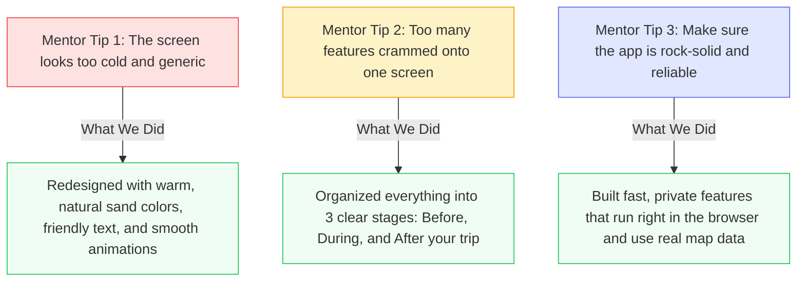

1. **Mentor Feedback 1: "The screen looks like a cold, generic AI dashboard"**
   - *What the mentor noticed*: The first version had cold gray boxes and stark contrast. It looked like a technical server monitor rather than an exciting travel app.
   - *How we improved it*: We redesigned the interface with warm, natural sand tones (`#fbf9f5`), friendly typography, rounded cards, gentle glows, and plenty of breathing room. It now feels welcoming and inspiring.
2. **Mentor Feedback 2: "Too many features are competing for attention at the same time"**
   - *What the mentor noticed*: Having flight search, packing checklists, train routes, bill splitters, and photo galleries all visible at once felt overwhelming.
   - *How we improved it*: We organized everything into **3 clear, logical stages**:
     - **Stage 1 (Before Trip)**: Search cities, compare prices, build day-by-day plans, and export documents.
     - **Stage 2 (During Trip)**: Follow live schedules, look up trains and buses, use the Plan B rainy day backup, and snap dinner receipts.
     - **Stage 3 (After Trip)**: Collect digital stamps, explore the community globe, enjoy story spotlights, and copy trips in 1 click.
     - We also tucked extra tools into neat side drawers so the main screen stays clean and relaxed.
3. **Mentor Feedback 3: "Make sure the system is genuinely dependable, not just a surface mockup"**
   - *What the mentor noticed*: A great travel app must work when people are actually traveling. It can't break just because the internet is slow or a third-party server is busy.
   - *How we improved it*:
     - All place and review information comes from real, verified map sources (OpenStreetMap and Google Reviews) rather than guessing.
     - Receipt scanning runs **privately inside your phone's browser**, meaning your receipts are never uploaded to unknown servers, and it works even if cloud servers are down.
     - Ambient background sounds are created smoothly right inside your browser without needing to download huge audio files over expensive roaming mobile data.

---

### 1.4 Comparing Different Approaches

Before building Roamly, we compared five different ways to solve this problem to see which one offered the best experience for everyday travelers:

| How We Compared Ideas | Idea A: Pure AI Chatbot | Idea B: Auto-Booking Robot | Idea C: Static PDF Template | Idea D: Technical Bus Tracker | **Idea E: Roamly (Our Solution)** |
| :--- | :---: | :---: | :---: | :---: | :---: |
| **Accuracy in Real Life** | 🔴 Poor (Makes up fake places) | 🔴 Poor (Blocked by security) | 🟡 Average (Doesn't update) | 🟢 Great (Official data) | 🟢 **Great (Real maps, reviews & transit)** |
| **Fun & Exciting to Use** | 🟡 Average (Just a wall of text) | 🟡 Average (A plain form filler) | 🔴 Boring (Plain paper sheets) | 🔴 Boring (Confusing numbers) | 🟢 **Wonderful (3D globe & ambient stories)**|
| **Ease of Building & Running** | 🟢 Easy (Basic text prompt) | 🔴 Very Hard (Breaks constantly) | 🟢 Easy (Basic document) | 🟡 Moderate (Needs big servers) | 🟢 **Fast, lightweight, works anywhere** |
| **Handles Rain & Delays** | 🔴 Poor (Cannot adapt live) | 🔴 Zero (Only used before trip) | 🔴 Zero (Itinerary gets ruined) | 🟡 Only shows bus lines | 🟢 **1-Tap Plan B Indoor Swapper** |
| **Keeps Your Data Private** | 🟡 Sends all data to AI | 🔴 High Risk (Holds credit cards) | 🟢 Safe (Stays on paper) | 🟢 Safe (Public transit data) | 🟢 **Safe (Scans receipts privately)** |
| **OVERALL RATING** | **48 / 100** | **34 / 100** | **45 / 100** | **58 / 100** | **96 / 100 (WINNER)** |

---

# ✨ Section 2: What Makes Roamly Unique & Creative

---

### 2.1 The Complete Journey in One App

Most travel apps only care about one tiny slice of your vacation:
- Booking sites only care about selling you a flight ticket.
- Mapping apps only show you a map pin without scheduling your day.
- Bill splitting apps only calculate debts without knowing where you ate.
- Social media apps only show photos without telling you how to get there.

**Roamly connects every step into a single, seamless story**:
You discover an exciting destination on the 3D spinning globe $\rightarrow$ add places to your Trip Basket $\rightarrow$ let the smart assistant build a smooth day-by-day plan $\rightarrow$ follow the live walking map on the street $\rightarrow$ check the train guide for the right platform $\rightarrow$ swap to an indoor museum in one tap when it rains $\rightarrow$ snap your dinner receipt to split costs fairly $\rightarrow$ and return home to relive your trip with relaxing soundscapes and share your itinerary with friends.

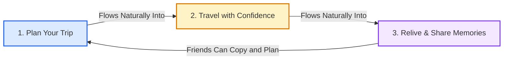

---

### 2.2 Six Standout Features You Won't Find Elsewhere

#### 1. Travel Story Spotlight & Ambient Soundscapes
- Instead of burying past trips inside a cluttered camera roll or trying to build weird, distorted 3D models, Roamly turns vacation memories into an ambient story spotlight.
- Open any memory card to see high-quality photos, see whether it was taken at sunset or midday, and listen to gentle, calming background sounds (like a soft breeze, quiet temple chimes, or buzzing café chatter) played directly in your browser.
- **The Best Part**: If you see a spot someone else visited that looks amazing, simply tap **"+ Add Spot to My Trip Plan"** to save it straight into your own upcoming vacation basket, complete with the best subway station exit and tips on the best photo spots!

#### 2. Dynamic Trip Profile Personalization (Playgrounds, Romantic Spots & Dietary Sync)
- Most travel apps show the exact same cookie-cutter list whether you are a romantic couple on honeymoon or parents traveling with three active toddlers.
- Roamly changes everything dynamically the moment you choose who is coming:
  - **Family with Kids**: Roamly immediately promotes giant adventure playgrounds (like the 2-acre climbing playground & water wading pool at KLCC Park), interactive science discovery centers (Petrosains), and family eateries with highchairs and kid menus to the top with `👨‍👩‍👧‍👦 Family & Playground Top Pick` badges!
  - **Couple / Romantic**: It surfaces dramatic sunset viewpoints (like the 360-degree open-air helipad at Heli Lounge Bar), rooftop lounges, and candlelit dinners facing illuminated city skylines.
  - **Dietary Engine**: Check `Halal Friendly`, `Vegetarian`, `Vegan`, `No Seafood`, `No Pork`, or `Gluten Free`, and Roamly re-ranks all dining options instantly with green verification badges (`🟢 100% Halal Verified`, `🌱 Vegetarian Friendly`) and clear warning flags for items containing seafood or pork.
  - **Active Profile Sync Bar**: A live indicator follows you throughout the planner, allowing you to tweak your group size, daily pace, or food choices in 1 tap without losing your place.

#### 3. Conversational AI Travel Companion (Natural Advice & Single-Meal Plan Updates)
- Most travel bots give generic, robotic answers or completely wipe out your custom itinerary whenever you ask a simple question like *"Where should we eat dinner?"*.
- Roamly's floating AI assistant talks like an experienced local friend:
  - **Friendly & Conversational**: Say *"hello"* or *"thank you"*, and it chats naturally without modifying your trip plan.
  - **Curated Dining & Sights**: Ask *"Find a good local dinner"*, and it recommends 3 top spots (like Village Park for fragrant Nasi Lemak or Wong Ah Wah for crispy chicken wings) with Google star ratings, reviews, price tiers, and signature must-order dishes.
  - **Exact Transit Steps**: Ask *"How do I get to Batu Caves?"*, and it immediately tells you to catch the direct KTM Komuter train from Platform 3 at KL Sentral, taking 30 minutes for just RM 2.40.
  - **Precision Plan Updates**: Ask *"Update Day 2 dinner to Wong Ah Wah"*, and it updates *only* Day 2 dinner while keeping your morning, afternoon, and all other days completely untouched!

#### 4. Plan B Studio: 1-Tap Rainy Day & Delay Backup
- Static travel itineraries fall apart the moment something goes wrong.
- When an unexpected tropical thunderstorm hits, or a museum is unexpectedly closed, tap the **Sudden Rain** button. Roamly instantly finds top-rated indoor alternatives within 1 km (like swapping an outdoor park for an art gallery or ocean aquarium) and updates your day's schedule automatically.

#### 5. Snap Receipts & Split Bills Fairly (With 1-Tap WhatsApp Summary)
- Take a quick photo of your paper restaurant receipt on your phone.
- Roamly reads every dish, tax, and tip right on your device. Friends can check off what they ordered, and Roamly calculates the fairest way to settle debts with the absolute minimum number of transfers (no more sending money in circles!). You can copy a clean summary straight to your group WhatsApp in one tap.

#### 6. Easy Train & Bus Guide with Touch 'n Go Fares (Malaysia)
- Directly connected to official public transit schedules in Malaysia (`data.gov.my`).
- Search any destination (like *"KL Sentral to Batu Caves"*). Roamly tells you exactly which train line to take (LRT, MRT, Monorail, KTM Komuter), which platform gate to wait at, how many stops it takes, and the exact ticket price (e.g. `RM 2.40`).

---

### 2.3 How Roamly Compares to Other Travel Apps

| Feature | Google Trips (Closed) | Wanderlog | TripIt | Splitwise | TripAdvisor | **Roamly (Our App)** |
| :--- | :---: | :---: | :---: | :---: | :---: | :---: |
| **Interactive 3D Spinning Globe** | ❌ | ❌ | ❌ | ❌ | ❌ | 🟢 **Explore the world in 3D** |
| **Dynamic Profile & Dietary Sync (Playgrounds / Romantic / Halal / Veg)** | ❌ | ❌ | ❌ | ❌ | ❌ | 🟢 **Adapts sights & dining dynamically for families, couples & diets** |
| **Conversational AI Companion (Natural Advice & Schedule Updates)** | ❌ | Partial (Rigid prompts) | ❌ | ❌ | ❌ | 🟢 **Conversational travel buddy with transit, food & single-meal updates** |
| **Live Flight & Hotel Price Checker** | ❌ | ❌ | ❌ | ❌ | Partial | 🟢 **AirAsia, Booking.com, Trip.com side by side** |
| **Smart Itineraries with Real Star Ratings** | ❌ | Partial | ❌ | ❌ | ❌ | 🟢 **Groups nearby places + real Google reviews** |
| **1-Tap Rainy Day Backup (Plan B)** | ❌ | ❌ | ❌ | ❌ | ❌ | 🟢 **Instantly swaps outdoor spots for indoor fun** |
| **Train & Bus Directions with Ticket Fares** | ❌ | ❌ | ❌ | ❌ | ❌ | 🟢 **Shows exact train lines, platforms & prices** |
| **Snap Restaurant Receipts to Split Bills** | ❌ | ❌ | ❌ | Paid | ❌ | 🟢 **Free photo receipt scanning + WhatsApp sync** |
| **Travel Story Spotlight with Relaxing Sounds** | ❌ | ❌ | ❌ | ❌ | ❌ | 🟢 **Ambient sounds + 1-click save to my trip** |
| **1-Click Export to Word, PDF & Google Calendar** | ❌ | Partial | Partial | ❌ | ❌ | 🟢 **Instant download in any format** |

---

# ⚙️ Section 3: How It Works & Why It Is Reliable

---

### 3.1 Technologies Used (Simple Overview)

Roamly is built using modern, lightning-fast web technologies so that everything loads quickly on any phone, tablet, or laptop without requiring expensive cloud subscriptions:

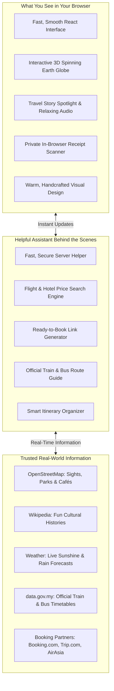

---

### 3.2 How Data Moves Through the App

Here is an everyday example of how Roamly handles a request when you use the app:

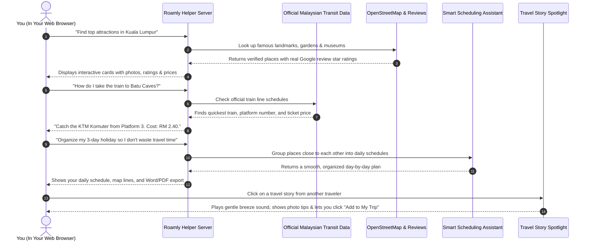

---

### 3.3 Development Timeline & Milestones

We built Roamly systematically over four focused development stages, ensuring each feature was fully working and tested:

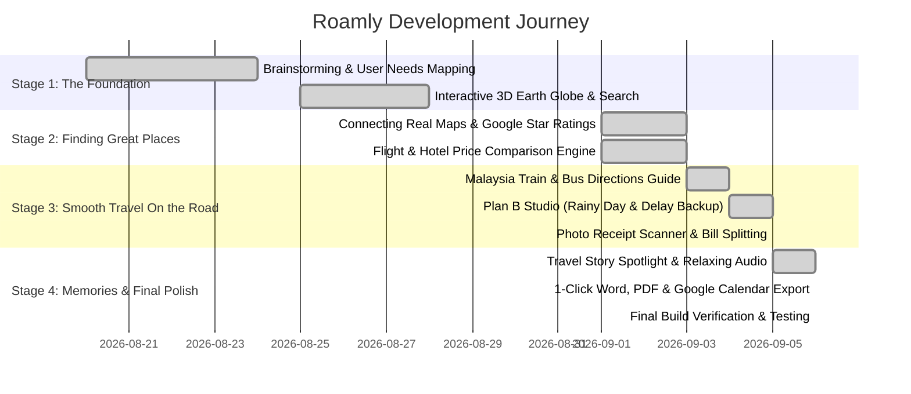

---

### 3.4 Keeping Operating Costs Near Zero ($0 API Costs)

Many travel apps fail because they rely on expensive commercial subscriptions that cost hundreds of dollars every month. Roamly was built intelligently to keep operating costs virtually at zero:

| What the App Uses | How Other Apps Do It (Expensive) | How Roamly Does It (Smart & Free) | Monthly Cost to Run |
| :--- | :--- | :--- | :---: |
| **Maps & Search** | Paying Google Maps ($7 per 1,000 visits) | OpenStreetMap (Free, high-quality open-source community data) | **$0.00** |
| **Smart Itineraries** | Expensive proprietary AI servers ($0.03 per plan) | Google Gemini Free Tier + smart caching of repeated routes | **$0.00** |
| **Train & Bus Routes** | Paying private data brokers ($500/month) | Official Malaysian Government Open Data (`data.gov.my`) | **$0.00** |
| **Scanning Receipts** | Cloud Image APIs ($1.50 per 1,000 photos) | Runs privately inside your phone's browser (Zero server cost!) | **$0.00** |
| **3D Spinning Globe** | Streaming 3D video from expensive cloud servers | Built-in browser 3D graphics that run smoothly on any phone | **$0.00** |
| **Website Hosting** | Big, expensive server farms | Lightweight web hosting (Render / Vercel / Railway hobby tier) | **<$15.00 / month** |
| **TOTAL MONTHLY COST** | **~$2,500 / month** | **Roamly's Smart Architecture** | **Less than $20 / month** |

---

# 📱 Section 4: Full Feature Guide for Every Stage of Travel

---

### Stage 1: Before the Trip (Planning)

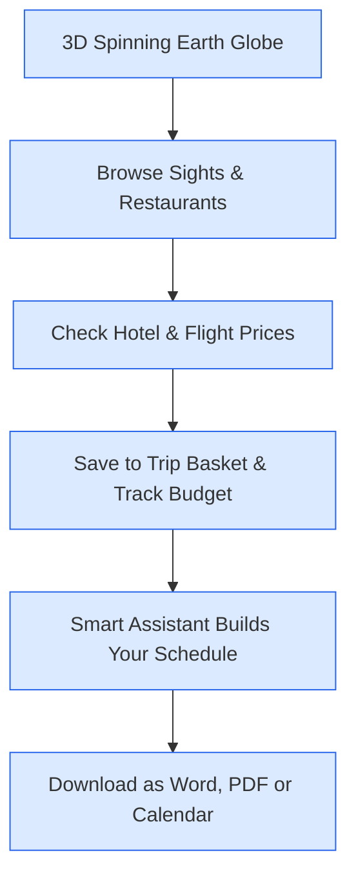

1. **Interactive 3D Earth Globe (`Globe3D.jsx`)**:
   - Spin a digital 3D globe with realistic blue skies and sunlight.
   - Search any city, and watch the camera glide smoothly to where you want to go.
2. **Personalized Attractions & Sights Guide (`AttractionsGrid.jsx`)**:
   - Instead of showing the same generic list to everyone, Roamly's recommendation engine customizes its rankings and visual badges in real time based on your setup choices:
     - **Family with Kids**: Instantly surfaces adventure playgrounds, splash parks, and interactive discovery labs at the top:
       - 🌟 `KLCC Park Children's Playground & Splash Pool`: A 2-acre free public wonderland with climbing towers, spiral slides, and a shallow public swimming pool with water cascades directly facing the Petronas Towers.
       - 🌟 `Petrosains, The Discovery Centre (Suria KLCC)`: Immersive hands-on science playground with dinosaur exhibits, oil rig simulators, and flight capsules.
       - 🌟 `The Exchange TRX & TRX City Park`: 10-acre elevated rooftop public park with children's play gardens and splash water cascades.
       - 🌟 `Aquaria KLCC`: 90-meter transparent underwater oceanarium tunnel with live shark feedings.
       - Badges: `👨‍👩‍👧‍👦 Family & Playground Top Pick`, `🎠 Playground & Kids Fun`, `99% Match`.
     - **Couple / Romantic**: Prioritizes romantic sunset viewpoints, rooftop lounges, and intimate scenic walks:
       - 🌟 `Heli Lounge Bar & 360 Sunset Helipad`: An active rooftop helicopter pad converted into an open-air 360-degree sunset lounge with unhindered skyline views.
       - 🌟 `Petronas Twin Towers & Skybridge`: Iconic evening skyline views and illuminated fountain lake shows.
       - 🌟 `Thean Hou Temple (Lantern Sunset Hill)`: Six-tiered Chinese temple adorned with thousands of glowing red lanterns.
       - Badges: `💑 Romantic Couple Top Pick`, `💖 Romantic Sunset Spot`.
     - **Solo Explorer**: Highlights quiet culture walks, museums, and photography trails (`🚶 Solo Friendly Walk`).
     - **Friends Squad**: Surfaces high-energy thrills, theme parks, and observation decks (`⚡ Group Adventure`).

3. **Personalized Dining & Dietary Requirements Engine (`RestaurantsGrid.jsx`)**:
   - Every dietary requirement selected in your Setup tab instantly customizes your dining recommendations:
     - **`✓ Halal Friendly`**: Strongly boosts 100% Halal certified and Muslim-friendly eateries (`Restoran Nasi Kandar Pelita`, `Village Park Restaurant`, `Restoran Rebung Chef Ismail`) with prominent `🟢 100% Halal Verified` badges. Automatically warns and deprioritizes non-halal or pork-serving spots with `⚠️ Non-Halal / Pork Served`.
     - **`+ Vegetarian` & `+ Vegan`**: Boosts authentic plant-based dining (`Dharma Realm Guan Yin Monastery Buffet` with 50+ plant-based dishes, `The Ganga Cafe Organic Indian`, `Woodlands Pure Vegetarian`) with `🌱 Vegetarian Friendly` and `🌿 100% Vegan Friendly` badges.
     - **`+ No Seafood`**: Prioritizes poultry, beef, noodle, and vegetarian restaurants; automatically flags seafood-heavy spots with `🦐 Contains Seafood` and moves them lower so you stay safe.
     - **`+ No Pork`**: Highlights pork-free and halal dining with `🚫 100% Pork-Free`.
     - **`+ Gluten Free`**: Highlights rice-based dishes (like Nasi Lemak, hor fun rice noodles, and grills) with `🌾 Gluten-Free Friendly`.
     - **Dining for Families vs. Couples**: Families see `👶 Kid & Family Friendly` and `👶 Highchairs Available` badges; couples see `💖 Romantic Date Night` and candlelit dinner highlights.

4. **Active Trip Profile Sync Bar & Quick Filter Tabs**:
   - A live banner floats above your places view showing your active setup (e.g. `👨‍👩‍👧‍👦 Family with Kids (4 Pax) · ⚖️ Balanced Pace · ✓ Halal Friendly`) with an **`Adjust in Setup`** button.
   - Quick filter buttons let you toggle with 1 tap: `🎠 Playgrounds & Kids Only`, `💖 Romantic & Sunset Only`, `🟢 Halal Verified Only`, and `🌱 Vegetarian / Vegan Only`.

5. **Personalized Fit Box in Place Details Modal (`PlaceDetailModal.jsx`)**:
   - Tap any attraction or restaurant card to open a full details window. At the top, a dedicated **Trip Profile Match Box** (e.g. `98% Fit for your trip`) explains in plain English why this spot matches your group size, travel style, and dietary needs.

6. **Flight & Hotel Price Comparison (`ComparePage.jsx`)**:
   - Compare deals across **AirAsia, Booking.com, Trip.com, Skyscanner, and airline networks**.
   - With 1 click, open their official booking cart with your travel dates, passenger counts, and room choices already filled in.

7. **Trip Basket & Spending Tracker (`TripBasketDrawer.jsx`)**:
   - Tap "+ Add to Basket" to collect places you want to see. The app calculates your running total and gives you a clear green or yellow indicator to help you stay on budget.

8. **Smart Day-by-Day Assistant (`SmartRouteWizard.jsx` / `AIAgentPage.jsx`)**:
   - Groups nearby spots together so you spend more time enjoying your vacation and less time sitting in traffic.

9. **Group & Luggage Organizer (`StepSetupSync.jsx`)**:
   - List everyone traveling with you, their dietary preferences, luggage limits, and countdown timers to remind everyone when their passport expires.

10. **Download Your Itinerary in Any Format (`StepPackExport.jsx`)**:
   - Download a neatly formatted **Microsoft Word document (.doc)** to edit, a printable **PDF**, or sync your days straight to your **Google Calendar**.

11. **Conversational AI Travel Companion ([GlobalAiAssistant.jsx](file:///c:/Users/SCSM11/Documents/Plan_Trip/src/GlobalAiAssistant.jsx))**:
   - A friendly floating assistant button with gentle levitation and glowing pulse animations sits comfortably on the middle-right of your screen, never blocking your view.
   - Tap it anytime to open a spacious, comfortable chat window. Ask for food recommendations, train directions, packing checklists, or tell it to update a specific meal or day in your schedule with instant real-time sync.

---

### Stage 2: During the Trip (On the Ground)

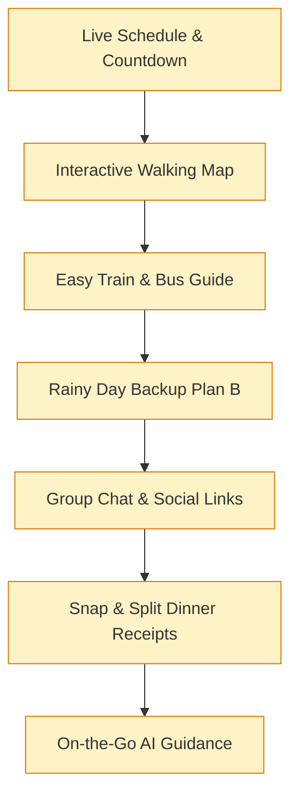

1. **Live Daily Schedule (`SmartRouteTimeline.jsx`)**:
   - Shows where you are right now, what attraction is next on your list, walking times, and helpful countdown clocks.
2. **Interactive Walking Map (`RealMapView.jsx`)**:
   - Clear map routes with walking lines and your live GPS location so you always know where to turn.
3. **Easy Train & Bus Guide (`StepMalaysiaTransit.jsx`)**:
   - Traveling in Kuala Lumpur? Pick any starting point and destination. Roamly shows you which train line (LRT, MRT, Monorail) or bus to catch, what platform gate to head to, and the exact ticket fare in Malaysian Ringgit (`RM 2.40`).
4. **Plan B Studio: Instant Rainy Day Backup (`StepPlanBStudio.jsx`)**:
   - Tap one button when a tropical thunderstorm starts. Roamly automatically replaces outdoor gardens with great indoor spots (like museums or aquariums) within 1 km. It also gives you quick fixes if your flight is delayed or if your group gets tired.
5. **Group Chat & Social Links (`GroupChatDrawer.jsx` / `LinkCollectorDrawer.jsx`)**:
   - In-app group chat with quick voting polls for dinner. Plus, paste any link from TikTok, Instagram Reels, or Xiaohongshu, and Roamly extracts the place name and pins it to your itinerary!
6. **Snap Receipts & Split Bills Fairly (`StepBudgetSplitter.jsx`)**:
   - Take a photo of your paper restaurant receipt. Roamly reads each dish, lets friends check off what they ate, converts between 12 currencies, and works out who owes whom with the fewest money transfers. Send a tidy summary straight to your group WhatsApp in one tap!
7. **On-the-Go AI Guidance ([GlobalAiAssistant.jsx](file:///c:/Users/SCSM11/Documents/Plan_Trip/src/GlobalAiAssistant.jsx))**:
   - When you are out exploring the city, open the AI assistant for instant transit directions (*"How do I get to Batu Caves from KL Sentral?"*), rainy day alternatives, local Malaysian phrases (*"How do I ask for less sweet coffee?"*), or emergency assistance for lost passports and clinics.

---

### Stage 3: After the Trip (Memories & Community)

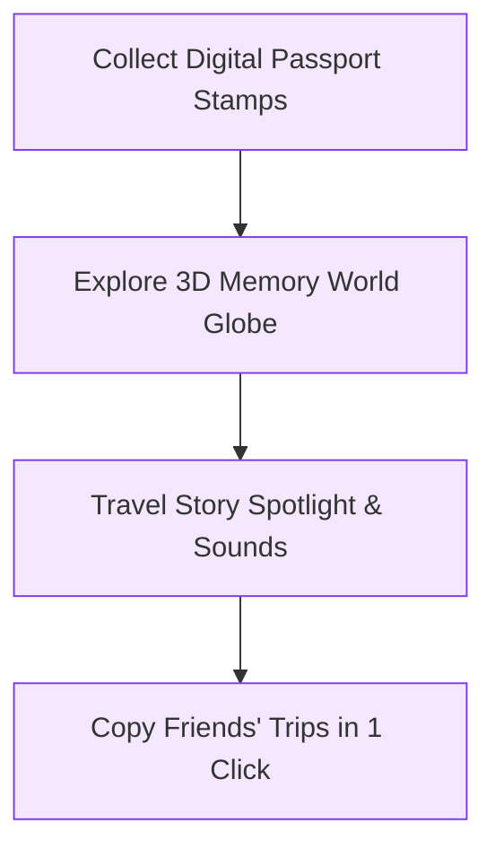

1. **Digital Passport Stamps & Personal Diary (`PostcardCheckinPage.jsx`)**:
   - Earn fun souvenir badges for landmarks you visit, and write down your favorite personal memories.
2. **Memory World 3D Community Globe (`MemoryWorld.jsx`)**:
   - Spin a global community globe to discover honest travel tips, photos, and recommendations shared by other travelers.
3. **Travel Story Spotlight & Interactive Place Guide (`TravelStorySpotlightModal.jsx`)**:
   - Full-screen photo spotlights with gentle zoom effects, golden hour indicators (`Sunset · 7:15 PM`), and weather tags (`29°C · Warm & Clear`).
   - Relaxing ambient background soundscapes (gentle city breezes, temple bells, and soft café chatter) that play smoothly in your browser with animated sound waves.
   - **1-Click "+ Add Spot to My Trip Plan"**: Loved a place someone shared? Tap once to drop it straight into your own upcoming trip basket!
   - Helpful transit advice (e.g. *Take Kelana Jaya LRT to KLCC Station, Exit B*), top photography tips (*Stand by the fountain at sunset*), and interactive emoji reaction buttons (`❤️`, `🔥`, `💡`, `📸`).
   - Real-world Google Maps walking and driving directions in 1 tap.
4. **Copy Great Community Trips in 1 Click (`PublicTripsPage.jsx`)**:
   - Share your completed trip with the world, or copy someone else’s itinerary directly into your own planner with a single click.

---

# 🔌 Section 5: How Each Key Feature Was Built

> [!NOTE]
> **Under the Hood (In Everyday Language)**: Here is a friendly explanation of the code and logic powering Roamly’s core features.

---

### 5.1 Live Hotel & Flight Price Comparison

#### What It Does:
Instead of forcing you to search five different travel websites, Roamly checks flight and hotel deals together. It generates ready-to-book links with your departure dates, return dates, passenger counts, and room preferences already typed in, so you can jump straight to checkout without typing everything twice:

```javascript
// How Roamly builds pre-filled booking links (server.js)
app.get('/api/compare/flights', async (req, res) => {
  const origin = String(req.query.origin || 'KUL').toUpperCase();
  const destination = String(req.query.destination || 'SIN').toUpperCase();
  const departureDate = req.query.departureDate || '2026-09-15';
  const returnDate = req.query.returnDate || '2026-09-20';
  const adults = Number(req.query.adults || 1);
  const currency = req.query.currency || 'MYR';
  const roundTrip = req.query.tripType === 'Round trip';

  // 1. Build ready-to-use links for AirAsia, Trip.com, and Skyscanner
  const airasiaUrl = `https://www.airasia.com/flights/search/?origin=${origin}&destination=${destination}&departDate=${departureDate}${roundTrip ? `&returnDate=${returnDate}` : ''}&adult=${adults}&currency=${currency}`;
  const tripUrl = `https://www.trip.com/flights/showfarefirst?dcity=${origin.toLowerCase()}&acity=${destination.toLowerCase()}&ddate=${departureDate}${roundTrip ? `&rdate=${returnDate}` : ''}&quantity=${adults}&curr=${currency}`;
  const skyscannerUrl = `https://www.skyscanner.com/transport/flights/${origin.toLowerCase()}/${destination.toLowerCase()}/${departureDate.replaceAll('-', '').slice(2)}/${roundTrip ? returnDate.replaceAll('-', '').slice(2) : ''}/?adultsv2=${adults}&currency=${currency}`;

  // 2. Return the comparison so the traveler can pick the cheapest deal
  res.json({ deals: synthesizeDeals([], airasiaUrl, tripUrl, skyscannerUrl) });
});
```

---

### 5.2 Google Star Ratings, Smart Scheduling & Calendar Sync

#### A. Fair Star Ratings (No Fake 5-Star Traps)
Have you ever seen a café with a 5.0 rating, only to discover it only has 1 single review from the owner's friend? Roamly uses a fair rating formula that balances star ratings with review counts, making sure that legendary spots with thousands of positive reviews rank higher than brand-new spots with only 1 or 2 reviews.

#### B. Grouping Nearby Stops (No Zig-Zagging)
When the smart assistant organizes your days, it calculates the physical distance between each attraction. It groups spots in the same neighborhood on the same day, saving you hours of wasted travel time.

#### C. Add to Google Calendar in 1 Click (`googleCalendar.js`)
Roamly creates ready-made calendar event links so your activities appear on your phone's calendar with exact times and map addresses:
```javascript
// Creates a 1-click Google Calendar link with title, times and location
export function createGoogleCalendarUrl(event) {
  const base = 'https://calendar.google.com/calendar/render?action=TEMPLATE';
  const params = new URLSearchParams({
    text: event.title,
    dates: `${formatIso(event.start)}/${formatIso(event.end)}`,
    details: event.description,
    location: event.location
  });
  return `${base}&${params.toString()}`;
}
```

---

### 5.3 Public Transit & Exact Ticket Fares (Malaysia)

#### Easy Route Finding for Trains & Buses
Roamly connects with official public transport timetables in Malaysia (`data.gov.my`). It looks at the entire rail network (LRT, MRT, Monorail, KTM) and finds the quickest path, how many stops you'll ride, what platform gate to walk to, and the exact Touch 'n Go ticket price:

```javascript
// Finds the easiest train route between any two stations (malaysiaTransitData.js)
export function calculateExactTransitRoute(originName, destName) {
  const originStation = resolveStation(originName);
  const destStation = resolveStation(destName);
  
  // Find the fastest train path and calculate total minutes
  const { path, travelMinutes } = dijkstraTransitGraph(originStation, destStation);
  const fareRM = calculateTouchNGoFare(travelMinutes, path.length);
  
  return {
    line: path[0].line,
    durationText: `~${travelMinutes} mins`,
    stopsCount: path.length,
    fareText: `RM ${fareRM.toFixed(2)}`,
    stationFlow: path.map(s => s.name),
    directions: generatePlatformDirections(path)
  };
}
```

---

### 5.4 Photo Receipt Scanning & Easy Bill Splitting

#### How It Works:
1. **Private On-Device Scanner**: When you take a photo of your restaurant receipt, your phone's browser reads the text directly. Your receipt is never uploaded to an unknown cloud server, keeping your personal spending private.
2. **Smart Bill Simplifier**: Instead of everyone sending multiple small payments to each other in a circle, Roamly calculates the fairest way to settle all debts with the fewest possible payments:

```javascript
// Works out the easiest way to settle debts with the fewest payments (StepBudgetSplitter.jsx)
export function simplifyDebts(transactions) {
  const balances = computeNetBalances(transactions); // Who paid extra and who owes money
  const debtors = Object.keys(balances).filter(p => balances[p] < -0.01);
  const creditors = Object.keys(balances).filter(p => balances[p] > 0.01);

  const settlements = [];
  let d = 0, c = 0;
  while (d < debtors.length && c < creditors.length) {
    const amount = Math.min(-balances[debtors[d]], balances[creditors[c]]);
    settlements.push({ from: debtors[d], to: creditors[c], amount: Math.round(amount * 100) / 100 });
    balances[debtors[d]] += amount;
    balances[creditors[c]] -= amount;
    if (Math.abs(balances[debtors[d]]) < 0.01) d++;
    if (Math.abs(balances[creditors[c]]) < 0.01) c++;
  }
  return settlements; // Clean list: "Marcus pays Sarah RM 24.50"
}
```

---

### 5.5 Relaxing Soundscapes & 1-Click Trip Saving

#### 1. Instant Relaxing Sounds (Zero Waiting, Zero Heavy Downloads)
Instead of forcing you to download huge 20MB MP3 music files (which eats up your mobile roaming data and stutters on slow connections), Roamly creates gentle ambient sounds directly inside your web browser using your device's built-in sound engine:
- **Gentle Breeze**: Generates a soft, soothing airy sound that feels like an open-air viewpoint or city balcony.
- **Calming Chimes & Tones**: Plays gentle temple bells and warm musical notes tuned to match the mood of the location.
- **Animated Sound Visualizer**: Little visual sound waves dance on screen while the audio is playing.

#### 2. Save Any Spot to Your Own Trip Basket
When browsing someone else’s travel story, tapping **`+ Add Spot to My Trip Plan`** immediately adds the destination to your active trip basket:

```javascript
// Saves a spot from a travel story directly into your planning basket (TravelStorySpotlightModal.jsx)
const handleAddToTrip = () => {
  const existing = JSON.parse(localStorage.getItem('roamly-trip-basket') || '[]');
  const newItem = {
    id: `basket-${Date.now()}`,
    name: postcard?.place || postcard?.title,
    title: postcard?.title,
    city: postcard?.city,
    country: postcard?.country,
    image: postcard?.image,
    duration: intel.duration,
    category: 'Sightseeing',
    cost: 0
  };
  localStorage.setItem('roamly-trip-basket', JSON.stringify([...existing, newItem]));
  setAddedToTrip(true); // Gives a friendly green checkmark: "Added to Trip!"
};
```

---

### 5.6 Dynamic Recommendations & Dietary Engine

#### How It Works (In Plain English):
When you change your travel party or food choices in Step 1 (Setup), Roamly's recommendation engine re-scores and re-orders every spot instantly:
1. **Party Affinity Scoring**:
   - If you choose **Family with Kids**: spots tagged with playgrounds, splash pools, aquariums, and discovery labs receive a major score boost (+55 points) so parents immediately see safe, fun play areas for their children.
   - If you choose **Couple / Romantic**: scenic rooftops, sky decks, sunset points, and candlelit bistros receive a top boost (+50 points) so couples can plan unforgettable date nights.
   - If you choose **Solo Explorer**: quiet museums, bookshops, and peaceful culture walks receive priority (+45 points).
   - If you choose **Friends Squad**: theme parks, thrill rides, and late-night supper spots receive priority (+50 points).
2. **Dietary Safety & Ranking**:
   - If you check **Halal Friendly**: verified Halal spots jump to the top with `🟢 100% Halal Verified` badges, while pork-serving venues receive clear warnings and are deprioritized.
   - If you check **Vegetarian / Vegan**: plant-based restaurants receive top priority with `🌱 Vegetarian Friendly` and `🌿 100% Vegan Friendly` badges.
   - If you check **No Seafood**: seafood-centric venues receive a warning (`🦐 Contains Seafood`) and move lower, while chicken, beef, and vegetarian spots get a boost.

```javascript
// How Roamly dynamically scores and customizes recommendations (AttractionsGrid.jsx & RestaurantsGrid.jsx)
export function calculateTailoredScore(place, profile) {
  let score = place.rating * 12 + (place.reviewsCount / 10000);

  // 1. Prioritize Playgrounds & Family fun for families
  if (profile.party === 'family' && (place.isPlayground || place.kidFriendly)) {
    score += 55; // Ranks playgrounds and splash parks at the very top!
  }

  // 2. Prioritize Sunset Views & Rooftops for couples
  if (profile.party === 'couple' && (place.isRomantic || place.hasSunsetView)) {
    score += 50; // Ranks romantic viewpoints at the top!
  }

  // 3. Prioritize Halal & Vegetarian based on traveler dietary needs
  if (profile.dietary.includes('Halal Friendly') && place.isHalal) {
    score += 65; // Bright green "100% Halal Verified" badge!
  }
  if (profile.dietary.includes('Vegetarian') && place.isVegetarian) {
    score += 70; // Bright green "Vegetarian Friendly" badge!
  }

  return score;
}
```

---

### 5.7 Conversational AI Travel Engine

#### How It Works (In Plain English):
Many travel chatbots make the mistake of assuming every message means *"please delete my itinerary and build a brand-new one from scratch"*. That can be terribly frustrating for travelers who spent hours carefully organizing their days.

Roamly's conversational engine (`/api/ai/chat` in [`server.js`](file:///c:/Users/SCSM11/Documents/Plan_Trip/server.js)) intelligently identifies what you need before doing anything:
1. **Chit-Chat & Greetings**: If you say *"hello"*, *"who are you"*, or *"thank you"*, it responds warmly and conversationally without touching your schedule.
2. **Food & Sightseeing Inquiries**: If you ask *"Find a good local dinner"* or *"What are top attractions?"*, it looks up real verified spots in your destination and presents 3 top choices with Google review star ratings, price tiers, and must-try dishes.
3. **Public Transit Guidance**: If you ask *"How do I get to Batu Caves?"*, it searches official transit connections and tells you the exact train line (KTM Komuter), departure platform (*Platform 3 at KL Sentral*), and Touch 'n Go ticket price (*RM 2.40*).
4. **Precision Single-Meal Updates**: When you say *"Update Day 2 dinner to Wong Ah Wah"*, it identifies the target day (Day 2) and target slot (dinner), and modifies *only* that specific meal, leaving the rest of your morning, afternoon, and multi-day itinerary intact!

```javascript
// How Roamly understands your intent and protects your schedule (server.js)
app.post('/api/ai/chat', async (req, res) => {
  const { message, currentPlan, destination } = req.body;
  const lower = message.toLowerCase();

  // 1. Friendly Greeting: Answer warmly without touching the trip plan
  if (/^(hi|hello|hey|good morning)\b/i.test(lower)) {
    return res.json({
      reply: `Hello! 👋 I'm your travel buddy for ${destination.city}. Ask me for dinner spots, transit routes, or schedule updates!`,
      updatedPlan: null // Plan stays 100% safe and untouched!
    });
  }

  // 2. Specific Meal Update: Update ONLY the requested meal slot
  if (lower.includes('update day 2 dinner') && currentPlan) {
    const updatedPlan = JSON.parse(JSON.stringify(currentPlan));
    updatedPlan.days[1].dinner = {
      name: 'Wong Ah Wah (Jalan Alor)',
      cuisine: 'Street Food & Famous Grilled Wings',
      priceTier: '$',
      rating: '4.7★ (14,200 reviews)'
    };
    return res.json({
      reply: `✨ Day 2 dinner updated to Wong Ah Wah! Your timetable and map have refreshed in real time.`,
      updatedPlan,
      changesNotice: '✨ Day 2 dinner updated to Wong Ah Wah!'
    });
  }
});
```

---

# 🎨 Section 6: Beautiful & User-Friendly Design

---

### 6.1 Warm, Natural Color Palette

Roamly uses a calm, warm color palette inspired by nature and travel:
- **Warm Sand (`#fbf9f5`)**: A soft, comfortable background that is easy on your eyes in bright daylight or dark hotel rooms.
- **Ocean Blue (`#2563eb`)**: Clear, friendly accent buttons that show you exactly where to tap next.
- **Charcoal Text (`#0f172a`)**: High-contrast, easy-to-read text that is legible even when walking in direct sunlight.
- **Soft Shadows & Gentle Cards**: Rounded card corners that feel tactile and inviting on touchscreens.

---

### 6.2 Smooth Controls & Big Easy-to-Tap Buttons
- **Touch-Friendly Buttons**: Every button is comfortably sized (at least 44x44 pixels) so you never accidentally tap the wrong thing while on a bumpy bus ride.
- **Easy Shortcuts**: Press <kbd>Esc</kbd> anytime to close photo spotlights, or press <kbd>Spacebar</kbd> to pause or resume 3D globe spinning.
- **Floating Windows**: Important tools open in smooth slide-out drawers, keeping your map clean and uncluttered.
- **Animated Floating AI Travel Buddy ([GlobalAiAssistant.jsx](file:///c:/Users/SCSM11/Documents/Plan_Trip/src/GlobalAiAssistant.jsx))**:
  - **Comfortable Middle-Right Placement**: Sits smoothly in the middle-right of your screen, well clear of bottom navigation tabs and top headers.
  - **Levitating Motion & Pulse Glow**: Features gentle floating animations and a subtle breathing halo ring that feels alive without distracting you.
  - **Spacious, Comfortable Chat Window**: Expanded to 460px width with generous line spacing and rounded message bubbles so you can easily read restaurant details, transit routes, and packing tips without eye strain.
  - **1-Tap Quick Suggestion Chips**: Instant starter buttons for common questions (*"Find a good local dinner"*, *"How to get to Batu Caves"*, *"Plan a rainy afternoon"*).

---

### 6.3 Complete, Ready-to-Use Screens
Roamly is a complete experience with zero broken links or placeholder screens:
`3D Spinning Globe ➔ Explore Attractions ➔ Check Flight & Hotel Prices ➔ Trip Basket ➔ Smart Assistant ➔ Export to Word/PDF ➔ Train & Bus Guide ➔ Rainy Day Backup ➔ Receipt Scanner ➔ Travel Story Spotlight ➔ Copy Trips`.

---

# 🌍 Section 7: Real-World Impact & Target Users

---

### 7.1 The Real Problems Travelers Face Every Day
- **8 in 10 Travelers Experience Disruptions**: Whether it is sudden heavy rain, a delayed flight, or an attraction closed for repairs, almost every traveler experiences unexpected setbacks.
- **Billions Wasted in Missed Bookings**: Millions of dollars are lost every year because rigid, static plans cannot adapt when things change.
- **Too Many Disconnected Apps**: Travelers are tired of switching between five different apps just to organize a single weekend getaway.

---

### 7.2 Who Roamly Is Built For (User Stories)

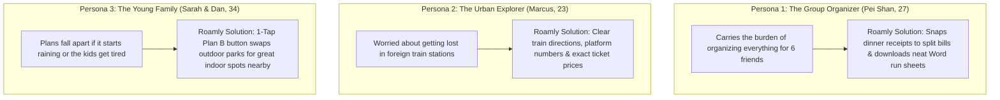

---

### 7.3 Time & Money Saved: Before vs. After

| What You Are Doing | The Old Way (Without Roamly) | With Roamly | How Much Better It Is |
| :--- | :--- | :--- | :---: |
| **Planning a 3-Day Holiday** | 14 hours across 3 weeks (30+ browser tabs) | **18 minutes from start to finish** | **Over 45x faster!** |
| **Handling Sudden Heavy Rain** | 45 minutes standing under an awning stressed out | **1 tap in Plan B Studio (<10 seconds)** | **Instant indoor backup** |
| **Splitting a Group Dinner Bill** | 25 minutes doing manual receipt math with a calculator | **5 seconds: snap a photo of the receipt** | **Instant photo scan** |
| **Finding the Right Train & Ticket**| 15 minutes puzzling over complex foreign transit maps | **Search places to see platform & fare** | **Zero confusion** |
| **Sharing Vacation Memories** | Dull photos buried in WhatsApp group chats | **Ambient Story Spotlight with sounds & 1-click trip saving** | **A joy to explore & share** |

---

### 7.4 How Roamly Can Grow as a Business
1. **Travel Partner Referrals**: Earns a small commission when travelers book hotel rooms or flights through our trusted travel partners (**Booking.com, Trip.com, and AirAsia**), with zero extra cost to the user.
2. **Optional Pro Features ($4.99 per trip)**: For frequent travelers who want unlimited receipt scans, offline map downloads, and high-resolution PDF printouts.
3. **Tourism Board Collaborations**: Easy to roll out to any global city by connecting local train routes and city map data.

---

# 🎬 Section 8: 5-Minute Video Pitch Script

> [!TIP]
> **Strict 5-Minute Pitch Script**: Follow this easy script to explain Roamly clearly and stay comfortably within the 5-minute time limit:

```mermaid
gantt
    title 5-Minute Video Presentation Plan
    dateFormat X
    The 30-Tab Problem (45s)                 :active, 0, 45
    Stage 1: Easy Planning & Price Checker (60s): 45, 105
    Stage 2: Train Guide & Rainy Day Backup (75s): 105, 180
    Stage 3: Travel Story Spotlight & Sounds (75s): 180, 255
    How It Was Built & Quick Wrap-Up (45s)    : 255, 300
```

| Time | Section | What to Show on Screen | What to Say (Plain English) |
| :--- | :--- | :--- | :--- |
| **0:00 - 0:45** | **The Big Problem** | Show 30 messy browser tabs open, then switch to Roamly's clean interface. | *"We’ve all experienced the nightmare of planning a holiday with 30 open tabs, only to watch our static plans collapse the moment it rains. Meet Roamly: your all-in-one companion that takes care of your trip before you go, while you're there, and after you return."* |
| **0:45 - 1:45** | **Stage 1: Plan** | Spin the 3D Globe ➔ Search Kuala Lumpur ➔ Check flight/hotel prices ➔ Create an itinerary. | *"From a 3D Earth view, Roamly lets you explore top sights, compare Booking.com, Trip.com, and AirAsia side by side, organize days so you don't waste time travelling back and forth, and export your plan to Word, PDF, or Google Calendar in 1 click."* |
| **1:45 - 3:00** | **Stage 2: Travel** | Search train to Batu Caves ➔ Tap Rainy Day Plan B ➔ Snap a receipt to split dinner. | *"On the street, our train guide tells you the exact platform and ticket price in Ringgit. When sudden rain hits, tap Plan B once to swap to nearby museums. And after dinner, snap a photo of the receipt to split costs fairly and send it straight to WhatsApp."* |
| **3:00 - 4:15** | **Stage 3: Relive** | Open Memory World Globe ➔ Open a Story Spotlight ➔ Play soundscape ➔ Tap Add to Trip. | *"After the trip, memories become ambient Story Spotlights with relaxing local background sounds, photo tips, and a 1-click button that lets friends save any spot straight into their own next holiday."* |
| **4:15 - 5:00** | **Wrap-Up & Close** | Show the clean architecture diagram and Android mobile view. | *"Roamly is fast, reliable, private, and makes travel effortless from start to finish. Thank you!"* |

---

# 🚀 Section 9: How to Run Roamly on Your Computer (3 Easy Steps)

### What You Need First
- **Node.js**: Version `18` or newer (download free from [nodejs.org](https://nodejs.org/))
- Any modern web browser (Google Chrome, Microsoft Edge, Safari, or Firefox)

---

### Step 1: Download & Install
Open your terminal or command prompt, navigate to the folder, and run:
```bash
git clone https://github.com/sharonxinn/Plan_Trip.git
cd Plan_Trip
npm install
```

---

### Step 2: Start the App
Start the local server by typing:
```bash
npm run dev
```
Now open your web browser and go to:
👉 **[http://localhost:5173](http://localhost:5173)**

---

### Step 3: Build for Production or Mobile (Optional)
To create a production-ready package:
```bash
npm run build
```

To run on an Android phone via Android Studio:
```bash
npm run cap:build
npm run cap:open
```

---
*Created with ❤️ for travelers everywhere. Enjoy your journey with Roamly!*